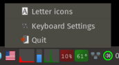

# wl-kbd

`wl-kbd` — индикатор раскладки клавиатуры для Wayland с tray-иконкой через
StatusNotifierItem (SNI) и небольшим меню в трее.

Он отслеживает активную раскладку через Wayland/xkbcommon, показывает либо
флаг, либо двухбуквенный значок, и умеет запускать `wl-kbd-config` из меню.

## Скриншот



## Возможности

- tray-индикатор для Wayland через SNI/dbusmenu
- два режима иконки:
  - **FLAG**: флаги из `wl-kbd-assets`
  - **LETTERS**: отрисованные сокращения вроде `US`, `RU`
- светлая/тёмная тема для буквенных иконок
- настраиваемый размер буквенной иконки
- тултип из двух строк:
  - список настроенных раскладок
  - обнаруженное сочетание переключения
- действия в меню:
  - переключение между флагами и буквами
  - переключение темы буквенной иконки
  - запуск `wl-kbd-config`
  - выход
- поддержка gettext/i18n

## Как это работает

- настроенные раскладки читаются из `XKB_DEFAULT_LAYOUT`
- текущая эффективная раскладка отслеживается по событиям Wayland-клавиатуры
- флаги загружаются по имени (`wl-kbd-layout-XX`)
- буквенные иконки рендерятся в памяти и экспортируются как ARGB pixmap
- переключение между FLAG и LETTERS перезапускает процесс с `-f` / `-l`,
  чтобы обойти кэширование tray host

## Тултип

Тултип в трее выглядит так:

```text
Layouts: us,ru
Switch shortcut: Alt+Shift
```

Определение сочетания — best-effort:

- для `labwc` `XKB_DEFAULT_OPTIONS` читается из `~/.config/labwc/environment`
- для остальных WM используется env процесса compositor или эвристики по конфигам
- если надёжно определить не удалось, показывается `unknown`

## Конфигурация

Файл конфигурации:

```text
~/.config/wl-kbd/indicator.ini
```

Поддерживаемые ключи:

```ini
[Indicator]
tray_style=FLAG
letter_theme=light
letter_icon_size=24
```

Примечания:

- `tray_style` = `FLAG` или `LETTERS`
- `letter_theme` = `light` или `dark`
- `letter_icon_size` ограничивается диапазоном `16..64`

## Командная строка

```bash
wl-kbd
wl-kbd -f   # старт в режиме FLAG
wl-kbd -l   # старт в режиме LETTERS
```

## Сборка

```bash
meson setup build --prefix=/usr
meson compile -C build
```

Тесты:

```bash
meson test -C build
```

Установка:

```bash
DESTDIR=/tmp/pkg meson install -C build
```

## Runtime-зависимости

- `libsni-exporter`
- `wl-kbd-assets`
- `wayland`
- `libxkbcommon`
- `cairo`
- `pango`

## Связанные проекты

- `wl-kbd-config` — GUI для настройки раскладок и переключения
- `wl-kbd-assets` — общие флаги и каталог раскладок
- `libsni-exporter` — библиотека экспорта SNI/dbusmenu, используемая индикатором
